# The Knots (Macramé)

# Goal for this Project
Welcome to The Knots (Macramé). Here you will find all the useful information about Macramé techniques, the materials that are used to create the Macramé products and it's history behind.

Here is a full responsive website on mostly used devices.

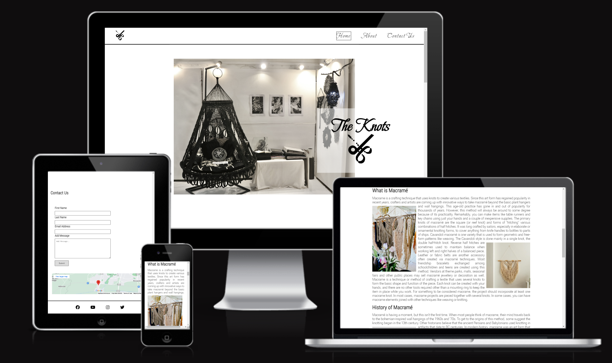

# Table of Contents
* [UX](#ux "UX")
    * [User Goals](#user-goals)
    * [User Inputs](#user-inputs)
    * [Owner Goals](#owners-goals)
    * [Requirements](#requirements)
    * [Expectations](#expectations)
    * [Design Choices](#design-choices)
        * [Fonts](#fonts)
        * [Icons](#icons)
    * [Wireframes](#wireframes)
    * [Features](#features)
        * [Existing Features](#existing-features)
            * [Navigation Bar](#navigation-bar)
            * [Welcome Page](#welcome-page)
            * [About Page](#about-page)
            * [Contact Page](#contact-section)
            * [Footer](#footer)
        * [Features to be Added](#features-to-be-added)
    * [Languages and Websites used](#languages-and-websites-used)
        * [Languages that I used](#languages-that-i-used)
        * [Tools](#tools)
    * [Testing](#testing)
        * [Unfixed Codes](#unfixed-codes)
    * [Formation](#formation)
    * [Credits](#credits)

# UX

## User Goals

* Visually appealing, including images.
* Easily navigated around.
* Quality and valuable content.
* Easily found contact details.
* Form to contact for additional information.
* Location of the office.

## User Inputs

* As a user I want the website to give me information about what methods or techniques are required to create Macramé products.
* As a user I want to be able to easily contact the website owner for additional information.
* As a user I want to be able to make contact the website owner via different social media.
* As a user I want to be able to easily navigate through the website.
* As a user I want to know where it is based.

## Owner Goals
* Spread as much information as possible about Macramé.
* Increase the number of buyers.
* Increase rankings on search engines.

### Requirements
* Easy to navigate on various screen sizes.
* Keep the user interested with information to make them want to engage with the website.
* Simple methods of contacting the owner.
* Visually inviting so users do not leave and recommend to friends and family.

### Expectations

* I expect all links to social media sites to be opened in a new tab.
* I expect all navigation links to work correctly.
* I expect screen size not to affect the quality of the website.
* I expect all information to be correct and accurate.

## Design Choices

### Fonts
In order site more appealing I have used the 
[Google Fonts](https://fonts.google.com/ "Google Fonts") to find a text that best suits the feel of the website. For the main "The Knots" I have used [Beau Rivage](https://fonts.google.com/specimen/Beau+Rivage?query=mon "Beau Rivage Font") as I believe it needed to look different than the rest of the website but not too different that it starts looking weird. For the main text I have chosen [Roboto Flex](https://fonts.google.com/specimen/Roboto+Flex?query=mon "Roboto Flex Font") as I feel it has a sharp, simple and easy to read look. To make the headers stand out form the text, I decided to use [Roboto Condensed](https://fonts.google.com/specimen/Roboto+Condensed?query=rob "Roboto Condensed Font") and to make the Navigation bar stand out I decided to use [Roboto](https://fonts.google.com/specimen/Roboto?query=rob "Roboto Font").

### Icons
I have used icons for my website from the [Font Awesome library](https://fontawesome.com/ "Font Awesome"). These icons will only be used where there is no explination is and are really common among the users like social media links, hamburger for navigational links on smaller devices.

# Wireframes
I have used Photoshop to develop wireframes for my website. I initially created the desktop version first and then scalled it down for tablet and smart phones. Because a requirement is to give little but quality information to the user to make them want to engage with the site. My original idea was to create 4 page website but after discussing this with my mentor I decided to go for one-page website. This gets the user through the content easier and quickly via scrolling or directly clicking the navigation bar.

**Wireframe Home Page**

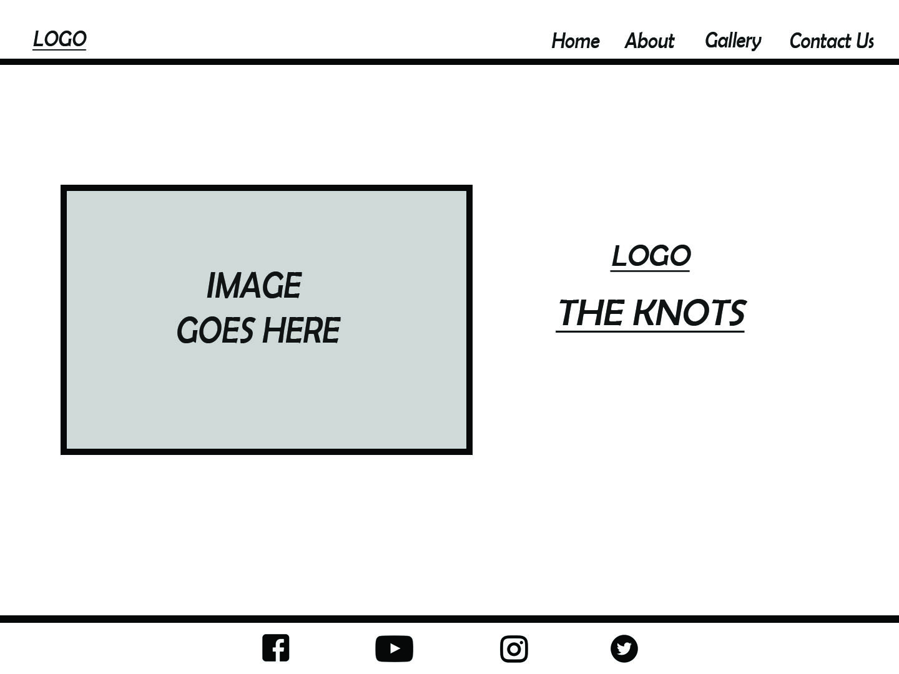

**Wireframe About Page**

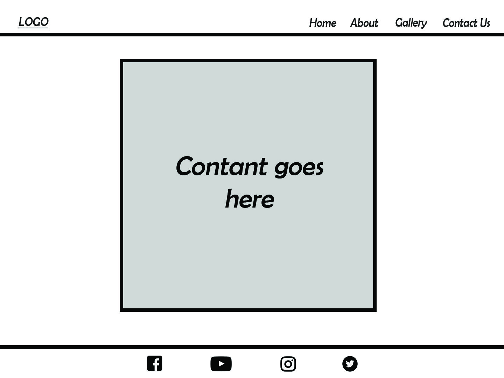

**Wireframe Gallery Page**

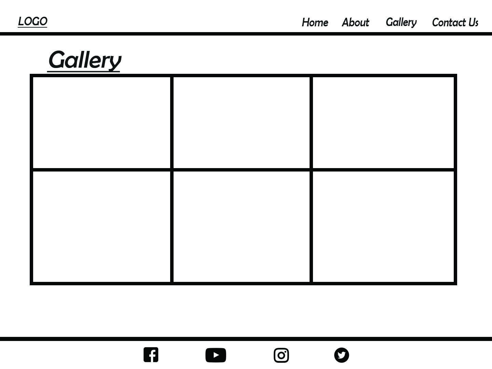

**Wireframe Contact Page**

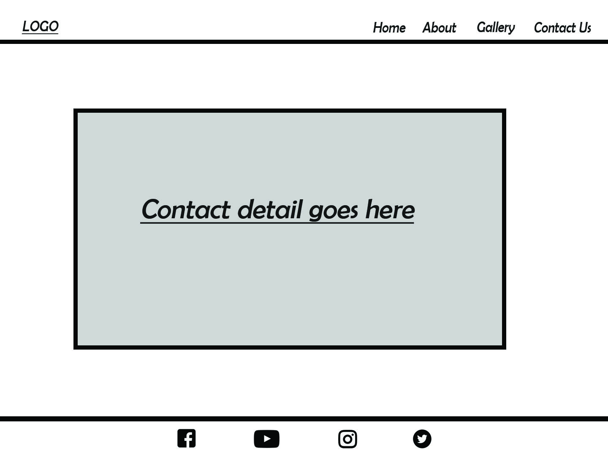

# Features

## Existing Features

### Navigation Bar

The navigation bar is fully responsive to allow for various screen sizes. It includes links to manover around the site easily. The site logo which is clickable to go link back to the home page.

+ Desktop (>=950px)

    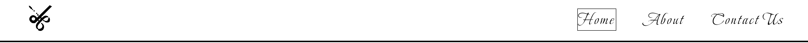

    In order for the user to visably see which of the links they are hovering over there is a rectangular border around the text.

    + Small devices max (<600px)

    - As the navigation bar would be unuseable in the desktop version on smaller devices, it takes on a hamburger style.

    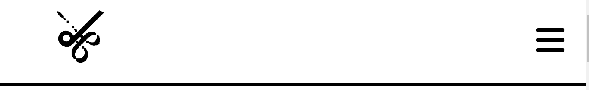

    When the hamburger icon is clicked it will slide in the nav bar below the website logo.

   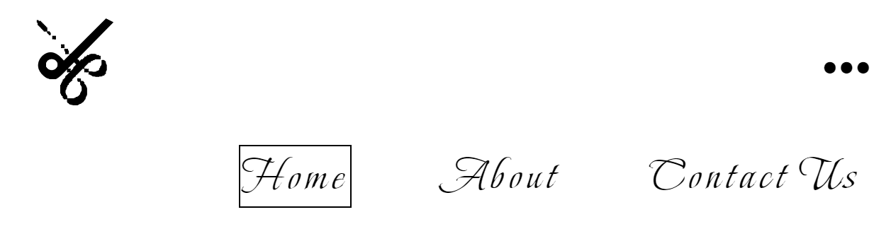

   ### Welcome Page

   *Desktop*

+ The welcome page gives a brief idea to the user on what Macramé is and who is welcome.

    

### About page

+ The about page gives a brief description of what is Macramé and it's history behind.
It also include useful links for user to navigate around the web for additional information. 

    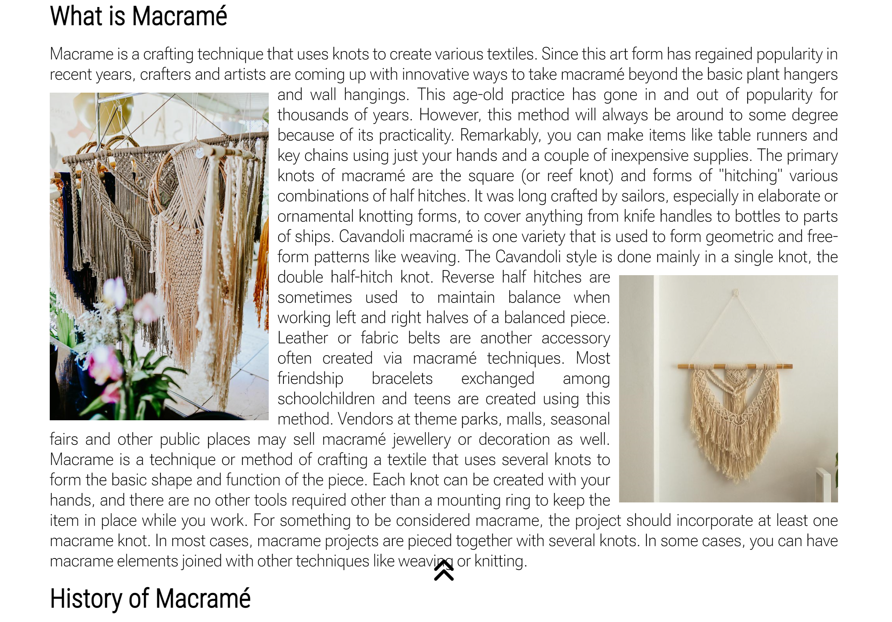

### Contact Section

+ The contact section allows the user to quickly send a message to the site owner. it also has a map of the location of where it is based.

    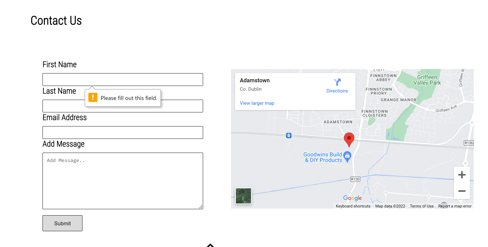

+ The text fields are all required fields and will not allow the user to submit until they have completed. There is also a hover effect on the submit button to give the user feedback that it is an active button.

### Footer

+ The footer contains the social media links related to Macramé pages. These social links all open in a new tab for ease of use to the user.

    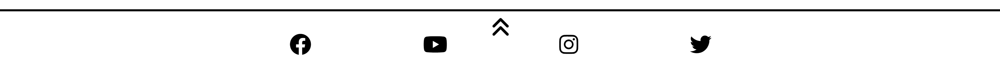

+ There is also a hover effect over the links to improve user experiance.

## Features to be Added

+ Add a shop if someone is interested to purchased Macramé products.
+ Add a wish-list for buyers.

# Languages and Websites used

## Languages that I used
* [HTML](https://en.wikipedia.org/wiki/HTML "HTML")
* [CSS](https://en.wikipedia.org/wiki/CSS "CSS")

## Tools
* [Gitpod](https://www.gitpod.io/ "Gitpod")
* [Photoshop](https://en.wikipedia.org/wiki/Adobe_Photoshop "Photoshop")
* [W3C HTML Validation Service](https://validator.w3.org/ "W3C HTML")
* [W3C CSS Validation Service](https://jigsaw.w3.org/css-validator/ "W3C CSS")
* [Font Awesome library](https://fontawesome.com/ "Font Awesome")
* [Google Fonts](https://fonts.google.com/ "Google Fonts")

# Testing

I feel that the site has hit the goals are required by everyone. The site responds nicely to all different screen sizes, the images look clean and sharp on all device sizes with no blank spaces. It allows the user to navigate around easily and also make contact via the contact form or social media. The content is simple and to the point and the site is not overcrowded.
\
&nbsp;

I have encountered several issues during testing. 
 + The side container which contains the logo and The Knots text gave me few issues but after doing some research I fixed those issues.

 + In my wireframes, I had designed the header with 2 3px line going across and in between there will be buttons and logo but after trying several thing I decided to leave the upper 3px line out and use just the bottom line instead.

 + I found that I was repeating alot of code in my style.css file in order to center items. I created a class to do this and then applied it when needed.

 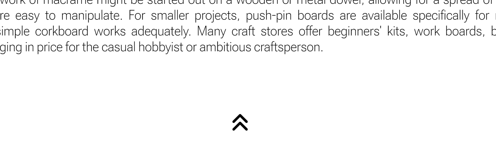

 When the user clicks on this icon the website will automatically scrolls back to top of the website.
 
 # formation

Following writing the code then commiting and pushing to GitHub, this project was formed using GitHub by the following steps.

+ Navigate to the repository on github and click 'Settings'.
+ Then select 'Pages' on the side navigation.
+ Select the 'None' dropdown, and then click 'master'.
+ Click on the 'Save' button.
+ Now the website is live on [https://naqij.github.io/The-Knots/]
+ If any changes are required or made they can be done by committing and push to GitHub and the changes will be updated.

# Credits

I would like to thanks.
* [Simen Daehlin](https://github.com/Eventyret "Simen Daehlin")

And **Kenan Wright**

For code insperation, help, advice and encouragment.

&nbsp;

For content and style insperation,

I used my wife's (Daima Zainab) thesis on Macramé and Celtic art.
* [Instagram page of Daima Zainab](http://instagram.com/daimaaaz_?igshid=YmMyMTA2M2Y= "Instagram page of Daima Zainab")

&nbsp;

For code insperation I have also looked into the Love running project to see which way the code reacted if changed into certein way and then applied the same on my webpage.

I have also used [https://www.w3schools.com/] for code insperation and testing the code before using on my website.

\
&nbsp;
[Back to Top](#table-of-contents)
\
&nbsp;