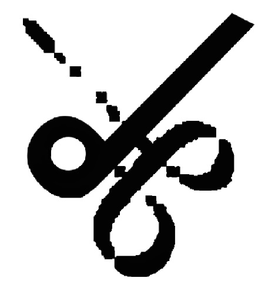

# The Knots (Macramé)

# Goal for this Project
Welcome to The Knots (Macramé). Here you will find all the useful information about Macramé techniques, the materials that are used to create the Macramé products and it's history behind.

Here is a full responsive website on mostly used devices.

# Table of Contents
* [UX](#ux "UX")
    * [User Goals](#user-goals "User Goals")
    * [User Stories](#user-stories "User Stories")
    * [Site Owners Goals](#site-owners-goals)
    * [User Requirements and Expectations](#user-requirements-and-expectations)
         * [Requirements](#requirements)
         * [Expectations](#expectations)
     * [Design Choices](#design-choices)
        * [Fonts](#fonts)
        * [Icons](#icons)
    * [Wireframes](#wireframes)
    * [Features](#features)
        * [Existing Features](#existing-features)
            * [Navigation Bar](#navigation-bar)
            * [Landing Page](#landing-page)
            * [About Page](#about-page)
            * [Contact Page](#contact-section)
            * [Footer](#footer)
        * [Features to be implemented](#features-to-be-implemented)
    * [Technologies used](#technologies-used)
        * [Languages](#languages)
        * [Tools and Libraries](#tools-and-libraries)
    * [Testing](#testing)
        * [Unfixed Bugs](#unfixed-bugs)
    * [Deployment](#deployment)
    * [Credits](#credits)

# UX

## User Goals

* Visually appealing, including images.
* Easily navigated around.
* Quality and valuable content.
* Easily found contact details.
* Form to contact for additional information.
* Location of the office.

## User Goals

* As a user I want the website to give me information about what methods or techniques are required to create Macramé products.
* As a user I want to be able to easily contact the website owner for additional information.
* As a user I want to be able to make contact the website owner via different social media.
* As a user I want to be able to easily navigate through the website.
* As a user I want to know where it is based.

## Owner Goals
* Spread as much information as possible about Macramé.
* Increase the number of buyers.
* Increase rankings on search engines.

### Requirements
* Easy to navigate on various screen sizes.
* Keep the user interested with information to make them want to engage with the website.
* Simple methods of contacting the owner.
* Visually inviting so users do not leave and recommend to friends and family.

### Expectations

* I expect all links to social media sites to be opened in a new tab.
* I expect all navigation links to work correctly.
* I expect screen size not to affect the quality of the website.
* I expect all information to be correct and accurate.

## Design Choices

### Fonts
In order site more appealing I have used the 
[Google Fonts](https://fonts.google.com/ "Google Fonts") to find a text that best suits the feel of the website. For the main "The Knots" I have used [Beau Rivage](https://fonts.google.com/specimen/Beau+Rivage?query=mon "Beau Rivage Font") as I believe it needed to look different than the rest of the website but not too different that it starts looking weird. For the main text I have chosen [Roboto Flex](https://fonts.google.com/specimen/Roboto+Flex?query=mon "Roboto Flex Font") as I feel it has a sharp, simple and easy to read look. To make the headers stand out form the text, I decided to use [Roboto Condensed](https://fonts.google.com/specimen/Roboto+Condensed?query=rob "Roboto Condensed Font") and to make the Navigation bar stand out I decided to use [Roboto](https://fonts.google.com/specimen/Roboto?query=rob "Roboto Font").

### Icons
I have used icons for my website from the [Font Awesome library](https://fontawesome.com/ "Font Awesome"). These icons will only be used where there is no explination is and are really common among the users like social media links, hamburger for navigational links on smaller devices.

# Wireframes
I have used Photoshop to develop my wireframes for my website. I initially created the desktop version first and then scalled it down for tablet and smart phones. Because a requirement is to give little but quality information to the user to make them want to engage with the site. I have used a one-page website. This gets the user through the content and quickly via scrolling or directly clicking the navigation bar.

# Features

## Existing Features

### Navigation Bar

The navigation bar is fully responsive to allow for various screen sizes. It includes links to manover around the site easily. The site logo which is clickable to go link back to the home page.

+ Desktop (>=950px)

    

    In order for the user to visably see which of the links they are hovering over there is a rectangular border around the text.

    + Small devices max (<600px)

    - As the navigation bar would be unuseable in the desktop version on smaller devices, it takes on a hamburger style.

    

    When the hamburger icon is clicked it will slide in the nav bar below the website logo.

   

   ### Welcome Page

   *Desktop*

+ The welcome page gives a brief idea to the user on what Macramé is and who is welcome.

    

+ The about page gives a brief description of what is Macramé and it's history behind.
It also include useful links for user to navigate around the web for additional information. 

    

### Contact Section

+ The contact section allows the user to quickly send a message to the site owner. it also has a map of the location of where it is based.

    

+ The text fields are all required fields and will not allow the user to submit until they have completed. There is also a hover effect on the submit button to give the user feedback that it is an active button.